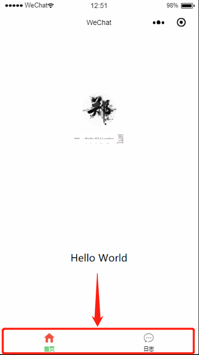
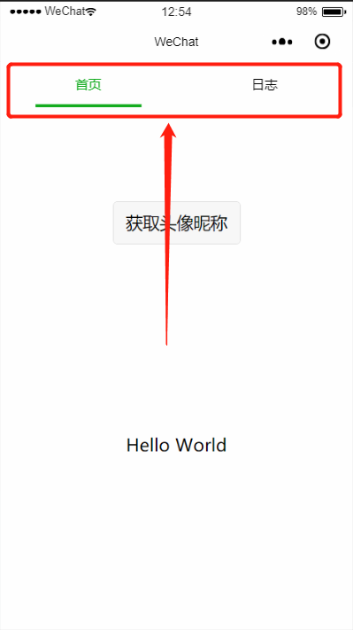

####  小程序基础 第二天

---

##### 一、 小程序项目的结构

```javascript
├── pages ······································ 【目录】存放所有的小程序页面
│   │── index ···································· 【目录】index 页面
│   │   ├── index.wxml ······························· 【文件】 index 页面的结构
│   │   ├── index.js ································· 【文件】 index 页面的逻辑
│   │   ├── index.json ······························· 【文件】 index 页面的配置
│   │   └── index.wxss ······························· 【文件】 index 页面的样式
│   └── logs ····································· 【目录】 logs 页面
│       ├── logs.wxml ································ 【文件】 logs 页面的结构
│       └── logs.js ·································· 【文件】 logs 页面的逻辑
└── utils ······································ 【目录】 存放小程序中用到的工具函数
├── app.js ····································· 【文件】 小程序逻辑
├── app.json ··································· 【文件】 小程序的公共配置
├── app.wxss ··································· 【文件】小程序公共样式表
├── project.config.json ························ 【文件】 开发工具配置文件
```

说明：

-  `app.js` 是小程序的入口文件，运行小程序，第一个被运行的就是 `app.js`
-  `app.json` 是小程序的全局配置文件，对小程序每个页面生效 
-  `app.wxss` 是小程序的全局样式文件，对小程序每个页面生效

注意：

- 对于小程序运行而言，`app.js` 和 `app.json` 是必不可少的
-  对于小程序页面而言， `.js` 和 `.html` 文件是必不可少的

---

##### 二、小程序页面的结构

###### 001 - 小程序页面和 `Vue` 组件的对比

-  每个 `.vue` 文件，是由 `template` 模板结构、`script` 行为逻辑、`style` 样式三部分组成的
-  每个小程序页面，是由 `.wxml` 结构、`.js` 逻辑文件、`.json` 配置、`.wxss` 样式表这四部分组成的


###### 002 - 小程序页面中每个文件的作用

-  `.wxml` : 用来描述当前这个页面的标签结构，同时提供了类似于 `Vue` 中指令的语法
-  `.js` : 用来定义当前页面中用到的数据、交互逻辑和响应用户的操作
-  `.json` : 用来定义当前页面的个性化配置，例如，为每个页面单独配置顶部颜色、是否允许下拉刷新等
-  `.wxss` : 用来定义样式来美化当前的页面

---

##### 三、创建小程序页面

-  在 `pages` 目录上右键，选择 “新建目录”，输入目录名称
-  在新建的目录上，再次右键，选择 “新建 `page`” ，输入 `page` 名称

注意：

-   输入 `page` 名称以后，会自动创建四个文件

---

##### 四、修改小程序项目的默认首页

-  打开 `app.json` 全局配置文件，找到 `pages` 节点。这个 pages 节点是一个数组，存储了项目中所有页面的访问路径。其中，`pages` 数组中第一个页面路径，就是小程序项目的默认首页。
-  所以只需要修改 pages 数组中路径的顺序，就可以可修改小程序的默认首页。

---

##### 五、text文本组件的用法

>  小程序提供了丰富的基础组件给开发者，开发者可以像搭积木一样，组合各种组件拼接称自己的小程序 <br />
>
> 小程序中的组件，就像 `HTML` 中的 `div` 、`p`、`span` 等标签的作用一样，用于搭建页面的基础结构

###### 001 - text 组件的属性

|    属性    |  类型   | 默认值 | 必填 |                      说明                      |
| :--------: | :-----: | :----: | :--: | :--------------------------------------------: |
| selectable | boolean | false  |  否  |                  文本是否可选                  |
|   space    | string  |   .    |  否  | 显示连续空格，可选参数：`ensp`、`emsp`、`nbsp` |
|   decode   | boolean | false  |  否  |                    是否解码                    |

**注： [text 组件详细文档](https://developers.weixin.qq.com/miniprogram/dev/component/text.html)**

-  `text` 组件相当于行内标签、在同一行显示
-   除了文本节点以外的其他节点都无法长按选中

###### 002 - 代码案例

```html
<view>
  <!-- 长按文本是否可选 -->
  <text selectable='true'>web</text>
</view>

<view>
  <!-- 显示连续空格的方式 -->
  <view>
    <text space='ensp'>H  a  c  k</text>
  </view>
  <view>
    <text space='emsp'>H  a  c  k</text>
  </view>
  <view>
    <text space='nbsp'>H  a  c  k</text>
  </view>
</view>

<view>
  <text>skyblue</text>
</view>

<view>
  <!-- 是否解码 -->
  <text decode='true'>&nbsp; &lt; &gt; &amp; &apos; &ensp; &emsp;</text>
</view>
```

---

##### 六、view视图容器组件的用法

> View 视图容器， 类似于 HTML 中的 div

###### 001 - 组件的属性


**注：[View 的详细文档](https://developers.weixin.qq.com/miniprogram/dev/component/view.html)**

###### 002 - 代码案例

```html
<view hover-class='box1'>
  <view
    hover-stop-propagation='true'
    hover-class='box'
    hover-start-time='2000'
    hover-stay-time='3000'>
    box1
  </view>
</view>
```

---

##### 七、button按钮组件的用法

###### 001 - 组件的属性

|  属性名  |  类型   | 默认值  |           说明           |
| :------: | :-----: | :-----: | :----------------------: |
|   size   | String  | default |        按钮的大小        |
|   type   | String  | default |      按钮的样式类型      |
|  plain   | Boolean |  false  | 按钮是否镂空，背景色透明 |
| disabled | Boolean |  false  |         是否按钮         |
| loading  | Boolean |  false  | 名称是否带 loading t图标 |

**注：[Button 组件的详细文档](https://developers.weixin.qq.com/miniprogram/dev/component/button.html)**

-  `button` 组件默认独占一行，设置 `size` 为 `mini` 时可以在一行显示多个

###### 002 - 案例代码

```html
<button size='mini' type='primary'>前端</button>

<button size='mini' type='default' disabled='true'>前端</button>

<button size='mini' type='warn' loading='true'>前端</button>

```

---

##### 八、input文本输入框组件的用法

###### 001 - input 组件属性

|   属性名    |  类型   | 默认值 |                  说明                  |
| :---------: | :-----: | :----: | :------------------------------------: |
|    value    | String  |   .    |            输入框的初始内容            |
|    type     | String  | 'text' |              input 的类型              |
|  password   | Boolean | false  |             是否是密码类型             |
| placeholder |  Sting  |   .    |           输入框为空时占位符           |
|  disabled   | Boolean | false  |                是否禁用                |
|  maxlength  | Number  |  140   | 最大输入长度，设置 -1 时不限制最大长度 |

**注：[input 组件的详细文档](https://developers.weixin.qq.com/miniprogram/dev/component/input.html)**

###### 002 - 案例代码

```html
<input placeholder='111' type='idcard' placeholder-style="color: skyblue" />
```

---

##### 九、image图片组件的用法

###### 001 - image 组件常用的属性

-  `src` --  支持本地和网络上的图片
-  `mode` -- 指定图片的裁剪、缩放的模式 

**注意：[image 图片组件详细文档](https://developers.weixin.qq.com/miniprogram/dev/component/image.html)** 

-  image 组件默认的宽度是 `300px` 、`高度是225px`
-  image组件中二维码/小程序码图片不支持长按识别

###### 002 - 案例代码

```html
<image src='/assets/5.jpg' mode='aspectFit'></image>

<image src='https://wx.qlogo.cn/mmhead/Q3auHgzwzM7teJKyb7Oicw6x2rDiaD5BkDPFP2kccFO6a566TzzUyUgA/0' mode='widthFix'></image>
```

---

##### 十、`wxss` 中常用的样式选择器

> `WXSS` 是一套样式语言，用来决定 `WXML` 的组件应该怎么显示

###### 001  -  初始 `wxss` 

- `wxss` 具有 `css` 大部分特性
- `wxss` 对 `css` 进行了扩充以及修改，以适应微信小程序的开发

**注：[wxss 详细文档](https://developers.weixin.qq.com/miniprogram/dev/framework/view/wxss.html)**

###### 002 - `wxss` 和 `css` 的区别  

-  尺寸单位
-  样式导入


---

##### 十一、什么是 `wxss`

###### 001 - `wxss` 目前支持的选择器

- 标签选择器
- id选择器
- class选择器
- 伪类选择器
- data-*属性选择器
- :nth-of-type() 等常用的 css3 选择器
- 其他…

**注： [wxss详细文档](https://developers.weixin.qq.com/miniprogram/dev/framework/view/wxss.html)**

###### 002 - 案例代码

```css

view {
  font-size: 12px;
}

#box {
  color: skyblue;
}

.box {
  color: lightcoral;
}

.box1::before {
  content: '加油';
  color: lightgreen;
}

view:nth-of-type(4) {
  color: lightseagreen;
}

[data-color='pink'] {
  color: pink;
}
```

---

#####  十二、什么是  `rpx` 尺寸单位

> `rpx`： 是微信小程序独有的，解决屏幕自适应的尺寸单位

-  可以根据屏幕宽度进行自适应，不论屏幕大小，规定屏幕宽为 `750rpx`
-  通过 `rpx` 设置元素和字体的大小，小程序在**不同尺寸**的屏幕上，**可以实现自动适配**

**注：[rpx 单位详细文档](https://developers.weixin.qq.com/miniprogram/dev/framework/view/wxss.html)**

---

##### 十二、`rpx` 与 `px` 之间的换算

以 `iPhone6` 为例，`iPhone6`  的屏幕宽度为 `375px` ，共有 750 个物理像素，则 `750rpx` = `375px` = `750` 物理像素

也就是 **`1rpx` = `0.5px` = `1 物理像素`** 

|      设备      | `rpx` 换算 `px` (屏幕宽度/750) | `px` 换算 `rpx` (750/屏幕宽度) |
| :------------: | :----------------------------: | :----------------------------: |
|   `iPhone5`    |       `1rpx` = 0.42`px`        |       `1px` = `2.34rpx`        |
|   `iPhone6`    |        `1rpx` = `0.5px`        |         `1px` = `2rpx`         |
| `iPhone6 Plus` |       `1rpx` = `0.552px`       |       `1px` = `1.81rpx`        |

那么也就是说：如果在`iPhone6`上，

如果要绘制宽`100px`，高`20px`的盒子，换算成`rpx`单位，

宽高分别为 `200rpx` 和 `40rpx`

**注：[rpx 单位详细文档](https://developers.weixin.qq.com/miniprogram/dev/framework/view/wxss.html)**

---

##### 十二、`rpx` 和 `iPhone6` 设计稿的关系

>开发微信小程序时设计师可以用 `iPhone6` 作为视觉稿的标准。

官方建议：

开发微信小程序时，设计师可以用 `iPhone6` 作为视觉稿的标准。

如果要根据 `iPhone6` 的设计稿，绘制小程序页面，可以直接把单位从 `px` 替换为 `rpx` 。

例如，假设 `iPhone6` 设计稿上，要绘制一个 宽高为 `200px` 的盒子，换算为 `rpx` 为 `200rpx`。

---

##### 十三、 `@import` 样式导入

###### 001 - 语法解释

- 使用 `@import` 语句可以导入外联样式表
-  语法格式：`@import "wxss 样式表文件的相对路径"`

###### 002 - 案例代码

```css
@import "/assets/common/common.wxss";
/* @import "../../assets/common/common.wxss"; */

.box {
  width: 375rpx;
  height: 375rpx;
  background-color: skyblue;
}
```

---

##### 十四、 全局样式和局部样式

###### 001 - 全局样式

-  定义在 `app.wxss` 中的样式为全局样式，作用于每一个页面。

###### 002 - 局部样式

-  在 `page` 的 `wxss` 文件中定义的样式为局部样式，只作用在对应的页面，并会覆盖 `app.wxss` 中相同的选择器。

**注意：当局部样式的权重大于或等于全局样式的权重时，才会覆盖全局的样式效果！**

**注：[wxss 详细文档](https://developers.weixin.qq.com/miniprogram/dev/framework/view/wxss.html)**

---

##### 十五、`app.json` 配置文件

> 小程序根目录下的 `app.json` 文件用来对微信小程序进行全局配置，
>
> 它决定了页面文件的路径、窗口表现、设置网络超时时间、设置多 tab 等。

1.  在 `app.json` 配置文件中，最主要的配置节点是：
   -   `pages` 数组：配置小程序的页面路径
   -  `window` 对象：用于设置小程序的状态栏、导航条、标题、窗口背景色
   -  `tabBar` 对象：配置小程序的tab栏效果

**注：[全局配置详细文档](https://developers.weixin.qq.com/miniprogram/dev/framework/config.html#全局配置)**

---

##### 十六、`pages` 数组的用法

> `app.json` 中的 `pages` 数组，用来配置小程序的页面路径

###### 001 -  基础配置

- `pages` 用于指定小程序由哪些页面组成，每一项都对应一个页面的 路径+文件名 信息。
- 文件名不需要写文件后缀，框架会自动去寻找对应位置的 `.json`、 `.js`、 `.wxml` 和 `.wxss` 四个文件进行处理。

###### 002 -  创建页面的另一种方式

- 打开 `app.json` --> `pages` 数组节点 --> 新增页面路径并保存 --> 自动创建路径对应的页面

###### 003 - 设置项目的首页

- 打开 `app.json` -> `pages` 数组节点
- 按需调整数组中路径的顺序，即可修改默认首页

**注意事项：**

- 数组的第一项代表小程序的小程序的初始页面也就是首页
-  小程序中新增/减少页面，都需要对 pages 数组进行修改，否则在运行小程序时就会报错

**注：[全局配置详细文档](https://developers.weixin.qq.com/miniprogram/dev/framework/config.html#全局配置)**

---

##### 十七、小程序窗口的组成部分

**常见的属性配置： [常见的属性配置](https://developers.weixin.qq.com/miniprogram/dev/reference/configuration/page.html)**


##### 十八、设置导航栏标题文字内容

-  `app.json` --> `window` --> `navigationBarTitleText`
-  将属性值修改即可

##### 十九、设置导航栏背景色

- `app.json` --> `window` --> `navigationBarBackgroundColor`
-  将属性值修改为指定的颜色就可以

##### 二十、设置导航栏标题颜色

-  `app.json` --> `window` --> `navigationBarTextStyle`
-  将属性值修改为指定的颜色就可以

##### 二十一、全局开启下拉刷新功能

>  通过手指在屏幕上的下拉滑动操作，从而重新加载页面数据的行为

-  `app.json` --> `window` --> 把 `enablePullDownRefresh` 的值设置为 true

##### 二十二、设置下拉刷新窗口的背景色

> 当全局开启下拉刷新功能之后，默认的窗口背景为白色 

- `app.json` -> `window` ->  `backgroundColor` 

##### 二十三、设置下拉loading的样式

> 当全局开启下拉刷新功能之后，默认窗口的loading样式为白色

-  `app.json` --> `window` --> `backgroundTextStyle` 

##### 二十四、设置上拉触底的距离

> 手指在屏幕上的上拉滑动操作，从而加载更多数据的行为

-  `app.json` --> `window` --> `onReachBottomDistance` 

**注意： 默认距离为 `50px`，如果没有特殊需求，建议使用默认值即可**

##### 二十五、`tabBar` 的概念

> `tabBar` 是移动端应用常见的页面效果，用于实现多页面的快速切换；小程序中通常将其分为底部 `tabBar` 和顶部 `tabBar`

**注意：`tabBar` 中，只能配置最少2个、最多5个 tab 页签，当渲染顶部 `tabBar` 的时候，不显示 `icon`，只显示文本**

**注： [tabbar 详细文档](https://developers.weixin.qq.com/miniprogram/dev/reference/configuration/app.html)**

 

##### 二十六、`tabBar` 的组成部分

-  `backgroundColor`：导航条背景色
-  `selectedIconPath`：选中时的图片路径
-  `borderStyle`：`tabBar`上边框的颜色
-  `iconPath`：未选中时的图片路径
-  `selectedColor`：`tab` 上的文字选中时的颜色
-  `color`：`tab` 上的文字默认（未选中）颜色


##### 二十七、`tabBar` 节点的配置项

###### 001 - `tabBar` 节点的配置项

|      属性       |   类型   | 必填 | 默认值 |                            描述                            |
| :-------------: | :------: | :--: | :----: | :--------------------------------------------------------: |
|      color      | HexColor |  是  |   .    |          tab 上的文字默认颜色，仅支持十六进制颜色          |
|  selectedColor  | HexColor |  是  |   .    |        tab 上的文字选中时的颜色，仅支持十六进制颜色        |
| backgroundColor | HexColor |  是  |   .    |              tab 的背景色，仅支持十六进制颜色              |
|   borderStyle   |  string  |  否  | black  |       tabBar 上边框的颜色， 仅支持 `black` / `white`       |
|      list       |  Array   |  是  |   .    | tab 的列表，详见 `list` 属性说明，最少 2 个、最多 5 个 tab |
|    position     |  string  |  否  | bottom |           tabBar 的位置，仅支持 `bottom`/ `top`            |
|     custom      | boolean  |  否  | false  |                       自定义 tabBar                        |

###### 002 - list 节点的配置项

|       属性       |  类型  | 必填 |                             说明                             |
| :--------------: | :----: | :--: | :----------------------------------------------------------: |
|     pagePath     | string |  是  |               页面路径，必须在 pages 中先定义                |
|       text       | string |  是  |                        tab 上按钮文字                        |
|     iconPath     | string |  否  |    图片路径，icon 大小限制为 40kb，建议尺寸为 81px * 81px    |
| selectedIconPath | string |  否  | 选中时的图片路径，icon 大小限制为 40kb，建议尺寸为 81px * 81px |

**注意：**

- **都不支持网络图片**
-  **当 position 为 top 时，不显示 icon。**

##### 二十八、页面配置

###### 001 - 页面配置和局部配置的关系

-  `app.json` 中的 `window` 节点，可以全局配置小程序中每个页面的窗口表现；
-  如果某些小程序页面，想要拥有特殊的窗口表现，此时，“页面级别的 `.json` 配置文件”就可以实现这种需求；

**注意：页面级别配置优先于全局配置生效**

###### 002 - 页面配置属性

**注： [页面配置详细文档](https://developers.weixin.qq.com/miniprogram/dev/reference/configuration/page.html)**

##### 二十九、生命周期的概念

> 生命周期（Life Cycle）是指一个对象从 创建 -> 运行 -> 销毁 的整个阶段，强调的是一个时间段。

###### 001 - 小程序的生命周期

- 小程序的启动，表示生命周期的开始
- 小程序的关闭，表示生命周期的结束
-  中间小程序运行的过程，就是小程序的生命周期

###### 002 - 小程序生命周期的两种类型

-  应用生命周期：特指小程序从启动 --> 运行 --> 销毁的过程；
-  页面生命周期：特指小程序中，每个页面的加载 --> 渲染 --> 销毁的过程；

**注意：页面的生命周期范围较小，应用程序的生命周期范围较大**


##### 三十 、小程序的生命周期函数

> 小程序框架提供的内置函数，会伴随着生命周期，自动按次序执行

1.  生命周期函数的作用：

   允许程序员在特定的生命周期时间点上，执行某些特定的操作。例如，页面刚加载的时候，在生命周期函数中自动发起数据请求，获取当前页面的数据；

**注意：生命周期强调的是时间段，生命周期函数强调的是时间点。**

##### 三十一、应用生命周期函数

###### 001 - 小程序生命周期的分类

-  应用生命周期函数
-  页面生命周期函数

###### 002 - 应用生命周期

- `app.js` 是小程序执行的入口文件，在 `app.js` 中必须调用 `App()` 函数，且只能调用一次。其中，`App()` 函数是用来注册并执行小程序的。
-  `App(Object)` 函数接收一个 `Object` 参数，可以通过这个 `Object` 参数，指定小程序的生命周期函数。

`app.js` 代码

```javasc
App({

  /**
   * 当小程序初始化完成时，会触发 onLaunch（全局只触发一次）
   */
  onLaunch: function () { },

  /**
   * 当小程序启动，或从后台进入前台显示，会触发 onShow
   */
  onShow: function (options) { },

  /**
   * 当小程序从前台进入后台，会触发 onHide
   */
  onHide: function () { },

  /**
   * 当小程序发生脚本错误，或者 api 调用失败时，会触发 onError 并带上错误信息
   */
  onError: function (msg) { }
})

```


##### 三十二、页面生命周期函数

-  每个小程序页面，必须拥有自己的 `.js` 文件，且必须调用 `Page()` 函数，否则报错。其中 `Page()` 函数用来注册小程序页面。
-  `Page(Object)` 函数接收一个 `Object` 参数，可以通过这个 `Object` 参数，指定页面的生命周期函数。

页面生命周期.js

```javascript
//index.js
//获取应用实例
const app = getApp()

Page({

  /**
   * 页面的初始数据
   */
  data: { },

  /**
   * 生命周期函数--监听页面加载
   */
  onLoad: function (options) { },

  /**
   * 生命周期函数--监听页面初次渲染完成
   */
  onReady: function () { },

  /**
   * 生命周期函数--监听页面显示
   */
  onShow: function () { },

  /**
   * 生命周期函数--监听页面隐藏
   */
  onHide: function () { },

  /**
   * 生命周期函数--监听页面卸载
   */
  onUnload: function () { },

  /**
   * 页面相关事件处理函数--监听用户下拉动作
   */
  onPullDownRefresh: function () { },

  /**
   * 页面上拉触底事件的处理函数
   */
  onReachBottom: function () { },

  /**
   * 用户点击右上角分享
   */
  onShareAppMessage: function () { }
})
```


